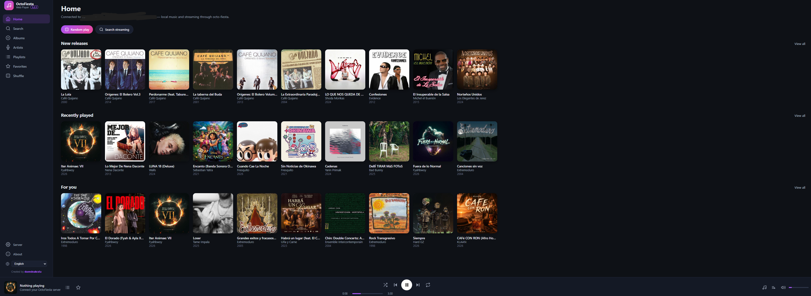
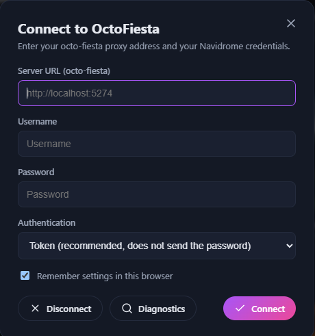
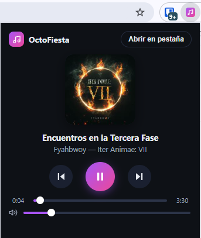

# OctoFiesta Web Player

A self-hosted web music player — a **Subsonic client** built for [**octo-fiesta**](https://github.com/V1ck3s/octo-fiesta).

Connect to your octo-fiesta proxy and play your local **Navidrome** library and your streaming
music (**Deezer**, **Qobuz**, **SquidWTF**, **Yandex**) straight from the browser — no extra
installs.

> Created by **duendeakrata**.

---

## Screenshots

<!-- Images live in docs/screenshots/ -->

<p align="center">
  
  
</p>
<p align="center">
  
</p>

## Features

- **Combined search**: search your local library and streaming at once (octo-fiesta downloads
  external tracks on the fly).
- **Views**: Home (new releases, recently played, for you), Albums, Artists, Playlists,
  Favorites and Shuffle.
- **Full player**: play queue, shuffle, repeat, volume, keyboard shortcuts and Media Session
  (system media keys).
- **Persistence**: remembers the queue and playback position between sessions.
- **Playlists**: create, add songs (from a single track, a whole album, or the currently
  playing song) and delete playlists.
- **Favorites** (star/unstar).
- **Synced lyrics** (OpenSubsonic `getLyricsBySongId`, via LRCLIB on octo-fiesta).
- **Languages**: Spanish and English, with a language selector in the sidebar.
- **No server required**: open `index.html` directly, run the tiny dev server, or install the
  **Chrome extension**.
- **No dependencies**: the dev server only uses Node's built-in modules.

## Requirements

- A running **octo-fiesta** server (with **Navidrome** or another Subsonic server behind it).
- **Node.js** (only for the server mode).

## Usage

### Option A: local server (recommended)

```bash
npm start
# or: node server.js 3000
```

Open `http://localhost:3000`, enter your octo-fiesta URL (default `http://localhost:5274`) and
your Navidrome credentials. Settings are saved in the browser.

On Windows, `Abrir Reproductor.bat` starts the server in the background (if needed) and opens
the player with a double click.

### Option B: open `index.html` directly

octo-fiesta sends open CORS headers, so opening `index.html` with a double click works without
any server. This requires octo-fiesta on `localhost` (if it runs on another machine on your
network, use the server mode).

### Option C: Chrome extension

**Install (unpacked):**

1. Open `chrome://extensions` in Chrome.
2. Enable **Developer mode** (toggle in the top-right corner).
3. Click **Load unpacked** and select the `extension` folder inside this repository.
4. The OctoFiesta icon (purple music note) appears in your toolbar.

> Note: an unpacked extension keeps working until Chrome restarts with it disabled — if it
> disappears, reload it from `chrome://extensions`. (Publishing to the Chrome Web Store is the
> way to make it permanent.)

**How it works:**

- Clicking the icon opens a small **popup** with the current track: cover art, title/artist,
  play/pause, previous/next, a progress bar and a volume slider.
- The popup is a **remote control** for the full player running in a tab, so music keeps
  playing even when the popup closes.
- The **"Open in tab"** button opens the full player in a tab (use it the first time to enter
  your server URL and credentials).
- Everything is stored locally (browser storage), nothing leaves your machine.

## Configuration

- **Server URL**: your octo-fiesta proxy address (e.g. `http://localhost:5274`).
- **Username / password**: your Navidrome credentials.
- **Authentication**: token (recommended, does not send the plain password) or plain password.

If something fails, open **Server → Diagnostics** in the player: it tests every endpoint and
shows which ones respond.

## Project structure

```
index.html        Main page
css/style.css     Styles
js/               Subsonic client, player and views
server.js         Static dev server (Node, no dependencies)
extension/        Chrome extension (popup + full player)
```

## Acknowledgments

- [octo-fiesta](https://github.com/V1ck3s/octo-fiesta) — the Subsonic proxy that makes
  streaming music possible.
- [Navidrome](https://www.navidrome.org/) — the excellent self-hosted music server.
- [Subsonic API](http://www.subsonic.org/pages/api.jsp) — the API specification this player
  speaks.
- [LRCLIB](https://lrclib.net) — synced lyrics for external tracks (through octo-fiesta).

## License

MIT — see [LICENSE](LICENSE).
